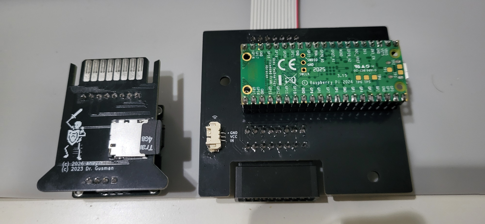
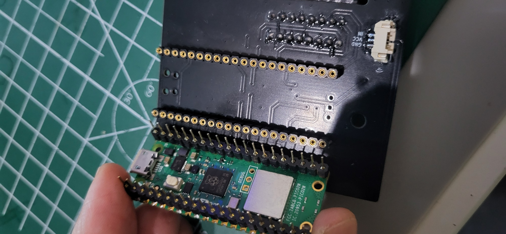
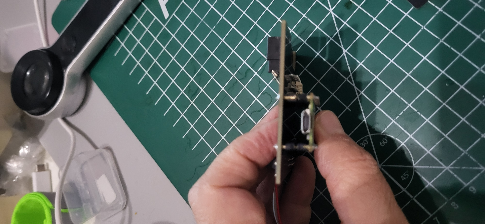
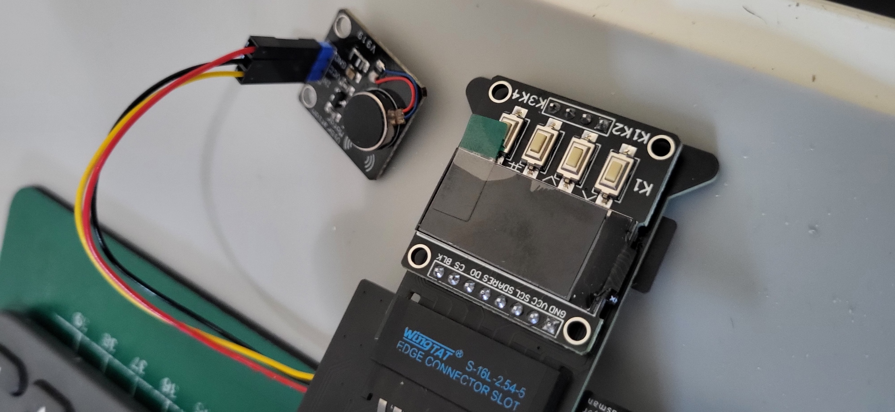
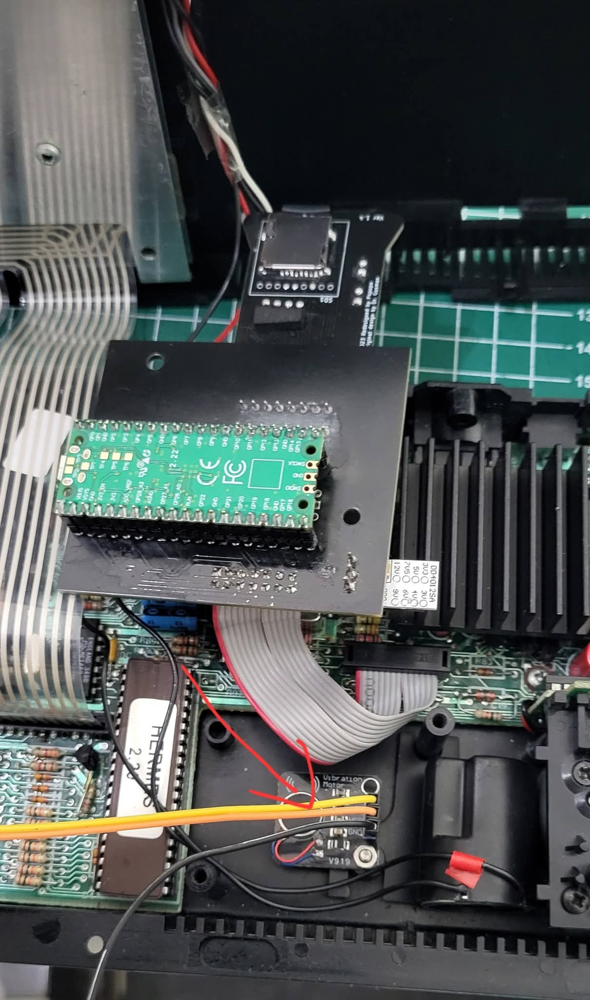

# MicroPicoDrive NG owner's manual

This manual shows you how to fit the board inside your Sinclair QL, prepare a
microSD card, work with cartridge images, and set everything up in System
Tools. It matches firmware version 2.10.1.

**A note on the installation chapter:** the operating instructions have been
checked against the firmware, and the photographs show the current NG boards,
the Pico orientation and the optional motor module. What we could not yet
confirm is the QL ribbon orientation, the mounting hardware and the exact
fitting steps for each drive bay — so treat that chapter as an outline, and
follow the instructions supplied with your board revision for those details.

## Contents

- [The two parts and firmware versions](#the-two-parts-and-firmware-versions)
- [Installing the mainboard in the QL](#installing-the-mainboard-in-the-ql)
- [Preparing the microSD card](#preparing-the-microsd-card)
- [First start and everyday use](#first-start-and-everyday-use)
- [System Tools reference](#system-tools-reference)
- [Bluetooth file management](#bluetooth-file-management)
- [Firmware updates](#firmware-updates)
- [Troubleshooting](#troubleshooting)

## The two parts and firmware versions

The **mainboard** stays inside the QL and connects to its Microdrive bus. It
carries the Raspberry Pi Pico that runs the firmware. The removable
**cartridge board** carries the display, four buttons and microSD socket.
It plugs into the mainboard's edge connector.

A **cartridge image** is a file on the microSD card that behaves like one QL
Microdrive cartridge. When you *mount* an image, the QL sees it as a cartridge
sitting in the drive; when you *eject* it, you are back in the file browser.
Mounting and ejecting happen on the screen — they are not the same thing as
physically plugging in or pulling out the cartridge board.

| Feature | Lite: Raspberry Pi Pico / RP2040 | Full: Raspberry Pi Pico 2 W / RP2350 |
|---|---|---|
| Image browsing, QL loading and saving | Yes | Yes |
| Display and motor settings | Yes | Yes |
| SD card firmware updates | UF2 file | BIN file and matching JSON manifest |
| Bluetooth file management and updates | No | Yes |
| Revert Firmware | No | When another firmware slot is available |
| BOOTSEL Mode menu entry | Yes | No |

Install the firmware that matches the Pico you actually fitted. The Pico 2 W's
wireless features use Bluetooth Low Energy (BLE), not Wi-Fi.

## Installing the mainboard in the QL

### Before opening the case

**What you'll need before you open the case:**

- The assembled mainboard and cartridge board
- The correct QL ribbon cable and mounting hardware for your kit
- A prepared microSD card

If your Pico came blank, plan to install the firmware before you close the QL
up again — see the **Firmware updates** section of the firmware manual.

1. Shut down the QL, disconnect its power supply and disconnect attached
   equipment. Remove any tape cartridges.
2. Work on a clean surface and handle the boards by their edges. Keep loose
   screws and other metal away from the electronics.
3. Open the QL using the service instructions for its case revision. Lift the
   cover carefully: the keyboard membrane tails connect it to the motherboard.
   Avoid pulling, sharply bending or trapping these tails.
4. Record the existing Microdrive cable routing and connector orientation
   before disconnecting anything.

### Fitting outline

The mainboard replaces an internal Microdrive mechanism. Its QL bus connector
is **J2**, a 14-pin (2 by 7) header. **J1** is the cartridge edge connector.
The optional motor connection is **J3**, the small three-pin socket marked
`GND`, `VCC` and `IN`. Confirm these markings against your actual board revision.



### Fitting the Pico

If the mainboard was supplied without a Pico, fit the correct board before
installing the assembly in the QL. Use a Raspberry Pi Pico for Lite firmware or
a Pico 2 W for Full firmware.

1. Disconnect QL and USB power. Hold the Pico by its edges and avoid touching
   the contacts.
2. Orient it as shown below: the Pico's USB connector sits at the same end as
   the mainboard's J3 motor socket. Check the orientation before engaging any
   pins.
3. Align both rows with the sockets. Start every pin squarely, then press the
   board down evenly with light pressure at both ends. Stop if a pin bends or
   the rows do not enter together.
4. Look along both sides to confirm that no pin is outside a socket and that
   the Pico is fully and evenly seated.



The Pico sits underneath the mainboard. That low profile is what leaves room
for the QL keyboard above it, so don't add tall headers or spacers unless your
enclosure's fitting instructions say you can.



### Installing and connecting the optional motor

Use a **driver-equipped vibration module** made for a logic-level trigger and
a 5 V supply, such as the module shown below. J3 is not a bare-motor output:
connecting a motor directly to it can overload GP11 and damage the Pico.

J3 is a three-pin Molex PicoBlade socket. Its electrical connections are:

| J3 connection | Function |
|---|---|
| GND | Ground |
| VCC | +5 V supply for the motor module |
| IN | Logic input from Pico GP11 |



1. Disconnect QL and power it off before connecting or moving the motor.
2. Inspect the labels at both ends. Connect J3 `GND` to the module's ground,
   J3 `VCC` to its supply input, and J3 `IN` to its trigger input. Use the
   supplied keyed lead where available. **Do not rely on wire colour alone**;
   cable colours and module pin order can differ.
3. Check that the plug is fully seated and that no contact is shifted sideways.
   Keep the lead away from the cartridge opening, keyboard membrane tails,
   sharp edges and screw posts.
4. Before fixing the module permanently, close or support the keyboard safely,
   power the QL and run **System Tools > LED & Motor Test**. The motor should
   run for five seconds. Switch off and disconnect power again before adjusting it.
5. Removing the original Microdrive exposes a support hole in the lower case.
   Place the motor module over that support as shown below and align one of its
   mounting holes with the case support hole. Pass the **supplied screw** through
   the aligned holes, fit the **supplied nut** on the opposite side, and tighten
   until the module is secure. Do not overtighten: the module PCB and plastic
   support can be damaged. Check that the module lies flat and that its solder
   joints cannot touch the QL motherboard or nearby metalwork.
6. Re-run LED & Motor Test after final assembly. Configure normal feedback under
   **System Tools > Motor** as described in the firmware section. Leave enough
   cable slack for servicing, but keep the lead out of the keyboard, cartridge
   and case-screw paths.



### Fitting the mainboard

1. Identify the drive position to be replaced using the kit's fitting
   instructions. The firmware has no menu setting for choosing `mdv1_` or
   `mdv2_`; numbering depends on the QL's drive-select chain and wiring.
2. Remove the selected mechanism as directed for the kit. Retain its hardware
   separately so it can be restored later.
3. Fit the mainboard with the specified supports and fasteners, with its
   cartridge connector aligned to the case opening. Check that the underside
   cannot touch conductive parts and that inserting a cartridge will not bend
   an unsupported board. Do not assume the original screws are the right length.
4. Connect the QL ribbon to J2 only after confirming pin 1 and the cable
   orientation at **both ends** against the board-specific fitting
   instructions. Check that neither connector is offset by a row or a pin.
   The stripe on the cable is not, by itself, proof of the right orientation.
5. If required, fit the Pico and optional motor as described above. Make these
   connections with power disconnected.
6. Route cables clear of case posts, sharp edges and the cartridge opening.
   Check connector seating, board clearance and the keyboard connections before
   refitting the cover.
7. Insert the prepared cartridge board without force, reconnect the QL and
   perform the first-start check described in the **First start and everyday
   use** section of the firmware manual.

Only the removable cartridge board is designed for powered insertion and
removal. Disconnect QL power before changing the mainboard, Pico, ribbon or
motor wiring. USB servicing also needs a board-specific power arrangement;
do not assume simultaneous USB and QL power is supported.

Hardware drawings and board photographs live in the
[hardware project](https://github.com/arleybls/micropicodrive-ng-hardware).

### If something goes wrong after reassembly

- **No display:** check cartridge-board seating and QL power. Disconnect power
  before inspecting internal ribbon or Pico connections.
- **QL cannot read the image:** wait for mounting, use the correct `mdv`
  number and try a known-good image; inspect wiring only with power
  disconnected.

See the firmware manual's Troubleshooting section for everything else.

## Preparing the microSD card

### Format and copy files

1. Back up any existing files before formatting: formatting erases them.
2. Use a card reader on your computer. Prepare a single normal data volume in
   **FAT32 or exFAT**. Both are enabled in this firmware; FAT12 and FAT16 are
   also supported by its filesystem library. NTFS and APFS are not supported.
   Check the selected device carefully before applying the format.
3. Copy valid `.mdv` or `.mpd` cartridge images onto the card. You can put them
   in the root or organise them into folders. Extract downloaded ZIP archives
   on the computer first.
4. Safely eject the card from the computer and insert it into the cartridge
   board's microSD socket in the socket's indicated orientation. Do not force it.

You don't need any firmware files or a `CONFIG.CFG` on the card just to browse
images. We haven't tested every card size, and a supported filesystem alone
doesn't guarantee a particular card will behave — so run
**System Tools > SD Check** once on a freshly prepared card.

Example card layout:

```text
/
  Games/
    CHESS.mdv
    CHESS.mdv.thumb       optional matching artwork
  Work/
    NOTES.mdv
  UTILITIES.mpd
  CONFIG.CFG             created when you tag an auto-load image
  .update/               needed only for firmware updates
```

The QL never sees this folder tree — it only sees the inside of the mounted
cartridge image. Copying a loose QL program or a ZIP file onto the card does
not put it inside a cartridge; use an image authoring tool on your computer
for that. The device itself cannot create new blank images.

### Image and filename limits

| Item | Requirement or behaviour |
|---|---|
| MDV image | 174,930 bytes |
| MPD image | 160,140 bytes |
| Browser file filter | `.mdv` and `.mpd`, case-insensitive |
| Auto-load extension | Use all-lowercase or all-uppercase: `.mdv`, `.MDV`, `.mpd`, `.MPD`; mixed-case extensions do not auto-load in this version |
| File and folder names | Keep each to 63 bytes or fewer, including extension; longer names are truncated by the browser and may fail to open |
| Full path | Keep below 300 bytes, including separators; shorter paths also avoid thumbnail lookup limits |
| Entries per folder | At most 64 eligible files and folders; use subfolders for larger collections |
| Hidden entries | Hidden/system files and names starting with a dot are omitted |

Use short, simple filenames when preparing your first card. An image with the
wrong size reports **Bad format**. Renaming an unrelated file to `.mdv` does
not convert it into a cartridge image.

When a folder exceeds the entry limit, a non-selectable `...` row appears.
The firmware collects entries in on-card order before sorting them for display,
so the omitted files are not necessarily the last alphabetically.

Optional artwork lives beside the image. The preferred `CHESS.mdv.thumb`
format is a raw 160 by 80 pixel RGB565 big-endian image, exactly 25,600 bytes.
The firmware also accepts legacy `CHESS.thumb` artwork as uncompressed 24-bit
BMP data. A renamed JPEG or PNG will not work. Missing artwork does not prevent
the cartridge from loading.

## First start and everyday use

### First-start check

1. Start with a card containing at least one known-good image and no firmware
   update files. Insert the cartridge board and power on the QL.
2. Wait for the display to initialise and the file browser to appear. Without
   a readable card, the firmware shows a waiting screen instead.
3. Use K1/K2 to highlight an image and press K3 to mount it. Wait for loading
   to finish and the cartridge screen to appear. (See Buttons below for the
   full button map.)
4. At the QL's SuperBASIC prompt, list the corresponding drive. For a unit
   installed as drive 1:

   ```basic
   DIR mdv1_
   ```

   Use `DIR mdv2_` if it replaces drive 2. A directory listing confirms the QL
   can read the mounted image. If it fails, check the image and drive position
   before investigating the physical installation with power disconnected.

Before you save any real work, read **Loading programs and saving your work**
below — saving on the QL and saving to the SD card are two separate steps.

### Buttons

The button labels are K1 through K4; a long press is approximately one second.

| Button | File browser | Mounted cartridge screen | System Tools / reports |
|---|---|---|---|
| K1 / UP | Previous entry | Eject image | Previous item / scroll up |
| K2 / DOWN | Next entry | Eject image | Next item / scroll down |
| K3 / SELECT | Open folder or mount image | Save image to SD | Activate item or cycle its value; close a report |
| K4 / TOOLS | Open System Tools | Shows `Eject first` | Leave menu or close report |
| Hold K3 | Tag or untag image for auto-load | No special save action | On `Pair Device`, request forgetting all pairings |
| Hold K4 | Pico 2 W: shortcut to Connect | Eject first | Use the displayed mode's controls |

Folders appear in brackets. Select `[..]` to go up one folder.
During QL drive activity the normal cartridge buttons are ignored; wait for
the QL operation to finish. The activity LED indicates drive selection/activity
and also blinks during SD operations. It does not distinguish QL reads from writes.

In Yes/No dialogs, K1 or K2 changes the answer and K3 confirms it. Confirmation
dialogs time out after about 30 seconds without carrying out the requested
action. Firmware update timeout handling is explained below.

### Loading programs and saving your work

Once mounted, use the image like a Microdrive cartridge. For example,
`LOAD mdv1_program` loads a BASIC program named `program`; some application
cartridges use `LRUN mdv1_boot`. Follow the program's own loading instructions
and substitute the correct drive number.

**Saving on the QL and saving to the SD card are two separate steps.** QL
writes change the mounted image in RAM. They are not automatically written
back to the card.

1. Save your work from the QL application, or use a command such as
   `SAVE mdv1_test` for a BASIC program.
2. Wait until the QL has finished using the drive.
3. Press **K3 on the cartridge screen**. Wait for **Saved** before removing
   anything or turning off power. This overwrites the original image file.
4. Press K1 or K2 to eject the image when you want to choose another one.

If you eject after QL writes without saving to SD, the device asks
**Eject? / Unsaved changes**. **Yes discards those changes**; it does not save
them. Choose No, press K3 to save, then eject again to keep your work.

The same two-step rule applies to deleting files or formatting a cartridge
from the QL. QL `FORMAT` acts on the mounted image and destroys its contents;
it does not format the SD card or create a new image file. Work on a copy if
you need to preserve the original cartridge.

Keep backups on your computer. Saving rewrites the image in place, so a failed
or interrupted SD save can leave the on-card file incomplete. If you see
**Save failed / Retry save!**, keep the unit powered and the image mounted,
resolve the card problem and retry K3. The firmware retains the RAM image after
a failed save, but ejecting or losing power loses that recovery opportunity.

### Auto-load a favourite image

In the browser, highlight an image and hold K3 for about one second. A red
marker in the left gutter identifies the tagged image. Only one image per
card can be tagged; tagging another replaces the previous choice. Hold K3 on
the tagged image again to clear the tag.

The firmware creates or updates `CONFIG.CFG` in the card root, recording the
image's path in a `FILE=` entry. It tries that image when the card is mounted
during startup. Tagging does not run a QL program; it only mounts the cartridge.
If you rename or move the image, tag it again at its new location. Use the
buttons to manage this file rather than editing it by hand.

### Removing a card or cartridge board

Save to SD, eject the image, and wait for any file operation to finish before
removing the SD card or cartridge board. The cartridge board supports powered
insertion/removal, but this does not preserve unsaved work or make interruption
of an SD write safe. Never remove it during a firmware update.

If the SD card was swapped while an image remained mounted, saving may report
**Different card / Save blocked**. Reinsert the original card and retry K3;
the RAM image is retained. This protection compares volume serial numbers,
so it is not a substitute for the save-and-eject procedure.

## System Tools reference

Eject the cartridge image, then press K4 in the browser or an available waiting
screen. K1/K2 moves through the list, K3 activates an item or cycles its value,
and K4 or **Exit** leaves the menu. **UI Options** and **Motor** are section
labels, not actions.

Display and motor changes take effect in the session and are saved to onboard
flash when you leave System Tools. Exit the menu before powering off. These
settings stay with the mainboard when you change SD cards; the auto-load tag
stays on each card in `CONFIG.CFG`.

### Diagnostics and maintenance

| Menu item | Availability | What it does |
|---|---|---|
| SD Check | Both builds; only if a card mounted when Tools opened | Reports filesystem, total/free space, and write/read speeds using a 32 KB test file with sampled data verification |
| System Info | Both | Shows firmware version, CPU type, clock, chip temperature, RAM used/free, flash capacity and application size |
| LED & Motor Test | Both | Blinks the activity LED and runs the fitted motor for five seconds; intentionally bypasses the Motor on/off setting |
| BOOTSEL Mode | Lite only | After confirmation, reboots into USB programming mode; normal drive operation stops |
| Exit | Both | Leaves Tools and saves changed display/motor settings |

**SD Check writes to the card.** It creates or overwrites `UIEXTTST.BIN` in the
root and deletes it when the read/check sequence completes. Do not keep your
own file under that name. A failed test can leave it behind. The test is a
quick access check, not a full-card surface test or filesystem repair.

Use K1/K2 to scroll diagnostic reports and K3/K4 to return. If you inserted a
card while Tools was already open, exit and reopen Tools to make SD Check
available. System Info temperature is the Pico's sensor reading, not a
measurement of the whole QL.

### UI Options

Press K3 repeatedly to cycle a setting. The label shows the current value.

| Setting | Values | Default without saved settings | Effect |
|---|---|---|---|
| Caption | Top, Mid, Bottom | Bottom | Positions the caption on the cartridge artwork screen |
| Dark Mode / Light Mode | Dark or Light | Dark | Switches display background/text and selection colours |
| Path Bar | On, Off | Off | Shows or hides the red path title bar in the file browser |
| Rainbow | Top Left, Top Right, Btm Left, Btm Right, Off | Top Right | Positions or hides the Sinclair rainbow corner decoration |

### Motor

These options only do something when the optional vibration motor is fitted.
They never affect the emulation or your saved cartridge data.

| Setting | Values / default | Effect |
|---|---|---|
| Motor | On / Off; default On | Master switch for normal vibration feedback |
| Cart | On / Off; default On | Feedback for physical cartridge-board insertion/removal detection |
| Transfer | On / Off; default On | Completion feedback for supported Bluetooth transfer/update operations |
| Alerts | On / Off; default On | Double-buzz feedback for error/alert events |
| Long Press | On / Off; default On | Feedback when a button reaches its long-press threshold |
| Load/Save | Off, 250ms, 500ms, 1s; default 500ms | Runs the motor during SD image load/save and for the selected extra time afterwards |

The `Load/Save` time is how long the motor keeps running *after* the operation
finishes — a little spin-down, like a real drive. The motor always runs for
the whole load or save itself. Turning **Motor** off silences all feedback at
once while remembering your individual settings, and **LED & Motor Test**
still runs the motor regardless, so you can always check the hardware.

### Bluetooth and firmware slots: Pico 2 W only

| Menu item | What it does |
|---|---|
| Connect | Opens a BLE session for a previously paired client to manage SD files and query the device |
| Pair Device | Allows a new client to pair; use a short K3 press |
| Paired Devices | Lists saved pairings; select one with K3 to open `Forget Device?`, or K4 to return |
| Update Firmware | Opens the wireless firmware update mode |
| Revert Firmware | Appears when the other slot contains firmware; asks before switching back and rebooting |

The radio only runs while you are in one of these menu modes, and only with no
image mounted and the QL drive idle — during normal cartridge use it is
completely off. K3 or K4 cancels the connect, pairing and update waiting
screens; if a firmware installation is already running, let it finish.

Holding K3 on **Pair Device** requests **Forget all paired devices?**. Confirm
only if you want to remove every stored pairing. After forgetting a device,
remove its old pairing at the client too before pairing again.

Revert Firmware invalidates the current slot and boots the other one. It is
not a permanent toggle between two retained versions; reinstall the newer
firmware if you want to return to it later.

## Bluetooth file management

The repository includes [tools/mdvtool.py](../tools/mdvtool.py), a computer
client for Pico 2 W. It requires Python 3.10 or later and a working BLE adapter.
Run these commands from the repository root:

```console
python -m pip install bleak
```

For first-time pairing, choose **System Tools > Pair Device**, then run:

```console
python tools/mdvtool.py pair
```

Follow the pairing prompts. For subsequent file operations, choose **Connect**
on the device, then use commands such as:

```console
python tools/mdvtool.py scan
python tools/mdvtool.py info
python tools/mdvtool.py ls /
python tools/mdvtool.py put CHESS.mdv /CHESS.mdv
python tools/mdvtool.py get /CHESS.mdv CHESS-backup.mdv
```

Use `python tools/mdvtool.py --help` for other commands, including rename,
delete and cartridge-label operations. Keep the device in Connect while
transferring; return to the browser when finished. The browser refreshes after
a session changes SD contents. This script is a file manager, not a firmware
upload client. Developers can consult the [BLE protocol](BLE_PROTOCOL.md).

## Firmware updates

Use a release intended for your board. Save and eject your mounted image first,
and keep power and the cartridge board connected throughout installation.

### From the microSD card

1. On your computer, create a folder called `.update` at the card root.
2. Copy the release's SD-update files into it:

   | Build | Files |
   |---|---|
   | Lite / RP2040 | The release's update `.uf2` |
   | Pico 2 W / RP2350 | The `.bin` and its matching `.json` manifest |

3. Safely eject the card, fit it to the device and power on. The update check
   happens before image auto-load. `.update` is hidden from normal browsing.
4. Review the installed and offered versions, choose Yes or No with K1/K2,
   and confirm with K3.

**Yes** installs and reboots. **No deletes the offered update files**, preventing
another prompt. Waiting for the 30-second timeout leaves the files for another
offer at the next startup. A differing older version can be installed from SD;
the prompt marks it as older. Pico 2 W ignores a same-version SD update. Lite
skips an image whose contents already match the running application; a changed
image with the same version number can still be offered.

### Over Bluetooth

On Pico 2 W, pair the upload client, eject the image and select **Update
Firmware**. Use a client implementing this project's BLE update protocol to
send the BIN and matching manifest. The repository does not include a dedicated
firmware upload client.

The wireless route requires a strictly newer version. Confirm installation
when prompted. No discards the upload; if the prompt times out, the firmware
attempts to store the verified update in `.update` on the SD card for the next
boot. That deferred route requires a working writable card. Watch for any
reported storage error rather than assuming the update was saved.

### Initial programming and USB recovery

Initial programming differs from an ordinary SD update. For Lite, the merged
`MicroPicoDrive-full.uf2` includes the bootloader needed on a blank Pico. The
application UF2 alone is not a complete first installation. Hold the Pico's
BOOTSEL button while connecting USB to enter its `RPI-RP2` programming drive,
then copy the merged image. The Lite menu's **BOOTSEL Mode** also enters this
mode on an already running unit.

Pico 2 W first installation additionally needs its partition table and radio
firmware, followed by the sealed application image. Follow the release's
board-specific instructions and the repository's
[firmware and build documentation](../README.md#firmware-update). Confirm the
hardware's USB power arrangement before servicing an installed mainboard.

## Troubleshooting

| Symptom or message | What to check or do |
|---|---|
| No display | Check cartridge-board seating and QL power. Disconnect power before inspecting internal ribbon or Pico connections |
| Waiting for SD / card will not mount | Check seating and a supported filesystem; try a backed-up, freshly prepared card |
| No images listed | Extract archives, check `.mdv`/`.mpd` extensions and hidden attributes, and open the correct folder |
| A file is missing / `...` at the end | Split a large folder into smaller ones; keep names within the browser limits |
| Bad format | Check image format and exact file size; recover a clean copy if necessary |
| Load failed | Check the original filename/path and card readability; a truncated long name can cause this |
| QL cannot read the image | Wait for mounting, use the correct `mdv` number and try a known-good image; inspect wiring only with power disconnected |
| Buttons do not respond | Wait for QL drive activity to finish; normal cartridge controls are gated while selected |
| Eject first | Save with K3, eject with K1/K2, then open Tools |
| Different card / Save blocked | Reinsert the original card and retry K3 without ejecting the image |
| Save failed / Retry save! | Keep power on and the image mounted, resolve card access/free-space problems and retry; the on-card image may already be incomplete |
| Event lost | The RAM image is untrusted. Only K1 eject works; saving is blocked. Reload a known-good saved image |
| Settings did not persist | Leave Tools through Exit or K4 before power-off; settings cannot be saved while the drive is in use |
| SD Check absent | Fit a readable card, leave Tools and reopen it |
| No vibration | Check Motor and the individual event settings; try LED & Motor Test, then inspect optional hardware with power disconnected |
| BLE options absent | Confirm Pico 2 W firmware and eject the mounted image; Lite has no Bluetooth |
| Pairing fails after forgetting a client | Remove the stale pairing on the client, then pair again through Pair Device |

One known quirk: a mainboard powered up on the bench, outside a QL, can pick
up a false drive-select signal and leave the activity LED stuck on — which
also blocks file operations and settings saves. Power-cycle the board and try
again. Inside a QL this doesn't happen; it is purely a bench condition.

## Documentation basis

Operation and menu details were checked against
[UserInterface.c](../src/ui/UserInterface.c),
[UserInterfaceExtension.c](../src/ui/UserInterfaceExtension.c),
[SD Check](../src/storage/sd_check.c),
[System Info](../src/ui/sys_info.c),
[filesystem configuration](../src/lib-sdcard/src/include/ffconf.h), and
[BLE implementation](../src/ble/ota_ble.c). The hardware overview was checked
against the locally available hardware repository's README and supporting notes.
No physical QL fitting, card compatibility or end-to-end hardware tests were
performed as part of writing this manual.
